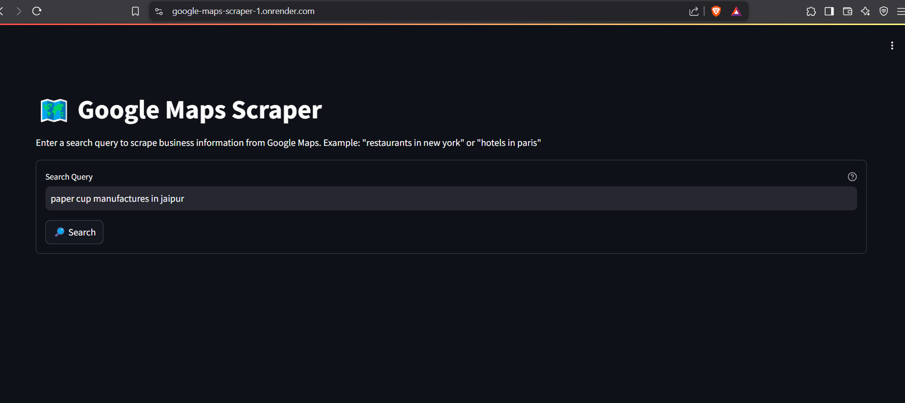

# Google Maps Scraper

A powerful and user-friendly web scraper for Google Maps built with FastAPI and Streamlit. This tool allows you to easily extract business information from Google Maps search results.

## Features

- 🌐 **Modern Web Interface** - Built with Streamlit for easy interaction
- ⚡ **Fast API Backend** - Powered by FastAPI for efficient data processing
- 🤖 **Headless Operation** - Runs in background without browser visibility
- 📊 **Multiple Export Options** - Download data as CSV or JSON
- 🔄 **Real-time Progress Updates** - See scraping progress as it happens

### Data Points Scraped:
- **Basic Info:**
  - Business Name
  - Category
  - Address
  - Phone Number
  - Website URL
- **Business Details:**
  - Rating
  - Total Reviews
  - Business Status
  - Operating Hours
- **Additional Data:**
  - Email Address (when available)
  - Google Maps URL
  - Booking Links (if applicable)

## Installation

1. Clone the repository:
```bash
git clone https://github.com/Nandaniipriya/Google-Maps-Scraper.git
cd Google-Maps-Scraper
```

2. Install backend dependencies:
```bash
cd backend
pip install -r requirements.txt
```

3. Install frontend dependencies:
```bash
cd frontend
pip install -r requirements.txt
```

## Usage

1. Start the FastAPI backend:
```bash
cd backend
python app/main.py
```

2. Start the Streamlit frontend:
```bash
cd frontend
streamlit run streamlit_app.py
```

3. Open your browser and navigate to:
- Frontend: http://localhost:8501
- API Documentation: http://localhost:8000/docs

## Preview website


## Sample Response

```json
{
    "total_results": 1,
    "locations": [
        {
            "category": "Shopping mall",
            "name": "Example Mall",
            "phone": "(123) 456-7890",
            "google_maps_url": "https://www.google.com/maps/place/...",
            "website": "http://www.examplemall.com",
            "email": "info@examplemall.com",
            "business_status": "Open",
            "address": "123 Example Street, City, State 12345",
            "total_reviews": "(1,234)",
            "rating": "4.5",
            "hours": "Monday-Sunday: 10:00 AM - 9:00 PM"
        }
    ]
}
```

## Technical Details

- **Backend:** FastAPI + Selenium
- **Frontend:** Streamlit
- **Scraping:** Python + BeautifulSoup4
- **Database:** No local storage (data returned directly)

## Configuration

The scraper can be configured through environment variables:
- `PORT`: API port (default: 8000)
- `HOST`: API host (default: 0.0.0.0)
- `HEADLESS`: Browser mode (default: 1 for headless)

## Error Handling

The scraper includes robust error handling for:
- Network issues
- Rate limiting
- Invalid queries
- Missing data fields

## Contributing

1. Fork the repository
2. Create your feature branch (`git checkout -b feature/AmazingFeature`)
3. Commit your changes (`git commit -m 'Add some AmazingFeature'`)
4. Push to the branch (`git push origin feature/AmazingFeature`)
5. Open a Pull Request

## License

This project is licensed under the GNU General Public License v3.0 - see the [LICENSE](LICENSE) file for details.

## Acknowledgments

- Built with FastAPI and Streamlit
- Uses Selenium for web automation
- BeautifulSoup4 for HTML parsing

## Disclaimer

This tool is for educational purposes only. Please check and comply with Google's terms of service before using this scraper.

---
Developed by [Nandani Priya]